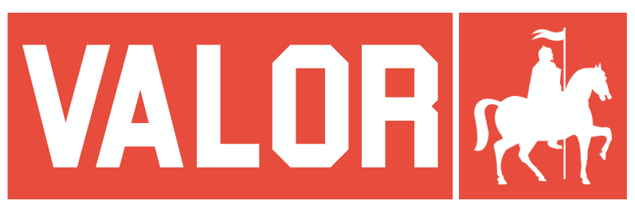

A work in progress implementation of Heroes III Battle Mode written in Rust.

## Screenshots

    
    

    
    

## License

This project is licensed under the [GNU General Public License v2.0](LICENSE).
